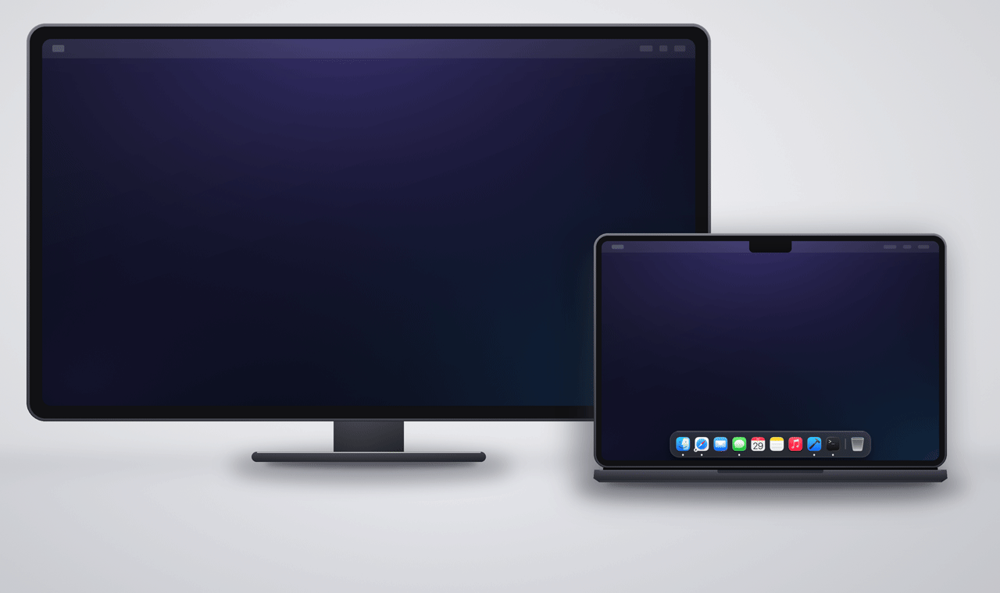

# Dockyard

A native macOS menu bar agent that draws a faithful, working copy of the Dock on every connected display. It reads the real Dock's own settings and never writes them.



<sub>Illustration, not a screen recording. The bars' layout, spacing, corner radius, and magnification curve are computed with Dockyard's own `DockGeometry`.</sub>

  

## Why

macOS renders the Dock on exactly one display at a time. On a multi-display setup the Dock either stays pinned to the primary display or migrates to whichever display the cursor last pushed against the bottom edge. There is no System Settings toggle and no public or private API to change this.

Dockyard does not try to move the real Dock. It reads the Dock's own configuration and draws an additional bar on the displays that do not have one, so a MacBook connected to an external display has a dock at the bottom of both screens, always.

There are other ways to solve this: paid utilities that draw a second dock with settings of their own, and full Dock replacements that swap the Dock for something else entirely. Dockyard is MIT-licensed and free, it mirrors the real Dock rather than replacing it, it asks for no permissions by default, and it contains no network code at all.

## Install

Requirements: macOS 14 or later to run. Xcode is only needed if you build it yourself.

Build from source until the first signed release is published:

```bash
git clone https://github.com/melisguclu/dockyard.git
cd dockyard
Scripts/make-app.sh release
cp -R build/Dockyard.app /Applications/
open /Applications/Dockyard.app
```

Dockyard is a menu bar agent with no Dock icon of its own. Its status item offers Settings, Focus Dock, Refresh, Launch at Login, and Quit.

## Uninstall

Turn *Launch at Login* off first — the login item is registered with `SMAppService` and survives deleting the app.

```bash
# then Quit from the status menu, and:
rm -rf /Applications/Dockyard.app
defaults delete com.dockyard.app
```

That is everything. Dockyard installs no helper tool, no launch daemon, and no kernel extension, and it has never written to any preference domain but its own.

## Features

### Fidelity

- Mirrors pinned apps, pinned folders and stacks, recents, and running applications, live
- Permanent Finder and Trash tiles and the separator before the Trash region, like the real Dock
- The Trash's own empty and full artwork, running indicators, hidden-app dimming, and Calendar showing today's weekday and date
- Magnification, using the system's own `tilesize` and `largesize`
- Auto-hide: turn hiding on and every bar hides with the real Dock, revealing on the same `autohide-delay` and sliding back out when the pointer leaves
- Bouncing icons while an application launches, following the Dock's own `launchanim` setting
- Hides over full-screen applications the way the real Dock does, revealing again when the pointer reaches the edge
- Follows the Dock's own settings live — `tilesize`, `magnification`, `autohide`, `launchanim`, `show-recents`, a folder's `displayas` and `arrangement`, and the rest ([full list](Docs/DOCK-PLIST-FORMAT.md)) — so it changes when the Dock changes
- Follows Reduce Transparency and Increase Contrast: the bar turns opaque and takes a full-strength outline

### Interaction

- Click to launch or activate, right-click for Show in Finder / Hide / Quit / Force Quit
- Hover a tile for its name, in the Dock's own balloon with the tail pointing back at the icon
- Click a pinned folder for its stack, as a fan, a grid, or a list, following the Dock's own *Display as*, *Show content as*, and *Sort by* settings; click a subfolder to walk down into it
- Click and hold a running app for its windows, the way the real Dock opens App Exposé, as a list rather than as thumbnails
- Drag files onto an app tile to open them with that app, or onto the Trash to move them there
- Spring loading: hold a dragged file over a running app to bring it forward, or over a folder to open its stack, on the system's own springing delay
- Right-click the separator for Dock Settings, the one item there that does not write the Dock's own preferences
- Optionally drag tiles into your own order, kept in Dockyard's own preferences and applied to every bar, with the real Dock left untouched
- Full keyboard access and VoiceOver: *Focus Dock* in the status menu, arrow keys, type-select, Return to open, and an accessibility element per tile with its own press and show-menu actions
- English and Turkish, with every user-visible string in a string table rather than in the source

### Every display

- A bar at the bottom of every connected display, at the same time
- Suppresses its own bar on the display currently hosting the real Dock (configurable)
- Per-display enable and disable, remembered across disconnects by display hardware identity, not by the volatile `CGDirectDisplayID`
- Handles display connect, disconnect, resolution change, rearrangement, sleep, and wake
- Launch at login via `SMAppService`

### With Accessibility granted

Accessibility is the one permission Dockyard can hold. It is off until you grant it from Settings, everything above works without it, and it buys these:

- An app's own windows, commands, and recent documents in its tile's context menu — New Window, New Incognito Window, Next Track, Xcode's recent projects — read from the app's menu bar
- A tile for every minimized window, between the separator and the Trash, like the real Dock; click one to bring that window back
- Badge counts — Mail's unread total, System Settings' pending update — read from the Dock's own item list and drawn to match it, down to the disc's size, position, digit weight, and red
- Tile order taken from the Dock itself rather than inferred, which puts recents and the minimized-window region exactly where the real Dock puts them
- Optionally keeping windows clear of the bar, off by default and behind its own warning, since macOS gives no third-party app a way to reserve screen space

## Privacy and security

- **No network code.** No `URLSession`, no sockets, no telemetry, no crash reporting, no update ping. CI greps for the whole class of APIs and fails the build on any hit.
- **No permission prompts for anything the bar does on its own.** No Screen Recording, no Full Disk Access, no helper tool, no root. Two things can ask, both on an action you took: opening a stack over `~/Downloads`, `~/Documents`, or `~/Desktop` reaches a TCC-protected folder, so macOS asks the first time you click one — the read is a directory listing, and a refusal leaves a row saying the folder cannot be read. Accessibility is optional, off by default, and covered above. See `Docs/SECURITY-MODEL.md`.
- **No subprocesses and no AppleScript.** Dockyard never spawns a process, never calls `killall`, and never sends an Apple Event.
- **Never writes to `com.apple.dock`** and never restarts the Dock. The only state it persists is its own preferences.
- **Hardened Runtime** with an entitlements file that grants nothing. Verify a build yourself:

```bash
codesign -d --entitlements :- /Applications/Dockyard.app
codesign -dvvv --verbose=4 /Applications/Dockyard.app
spctl -a -vvv /Applications/Dockyard.app
lsof -nP -a -p "$(pgrep -x Dockyard)" -i
```

The Dock preference domain is treated as untrusted input: every entry is validated, and a tile is only launchable if it resolves to an existing `.app` bundle with a real executable. See `Docs/SECURITY-MODEL.md`.

## Performance

Dockyard is event-driven. There is no polling anywhere in the observation path: preference changes arrive through a distributed notification with a filesystem watcher as a backstop, application state through `NSWorkspace` notifications, minimize and restore through one `AXObserver` per application, and display changes through `CGDisplayRegisterReconfigurationCallback`. Snapshots are diffed before they are published and again before they are rendered, so the frequent notifications that do not change the rendered output cost nothing.

Measured on an M2 MacBook Pro with a Studio Display, macOS 26.5.2, 25 tiles, `tilesize` 31, one bar because the Studio Display hosts the real Dock:

```
CPU at rest               0.0002% of one core   (0.2 ms of CPU in 120 s)
Idle wakeups at rest      0                     (none at all in 120 s)
Memory footprint          18.4 MB
CPU while magnifying      0.58% of one core     (pointer swept at 500 pt/s)
Magnification frame rate  59.8 /s on a 60 Hz display, one layout pass per vsync
Cold start to first paint 117 ms
Network connections       0, and no networking symbol linked into the binary
```

Reproduce with `Scripts/benchmark.sh` for the rest and memory figures and `Scripts/frame-trace.sh` for the frame figures, both while Dockyard is running. Neither needs `sudo`. `Docs/PERFORMANCE.md` has the full set, the method behind each number, and the twenty-three rules that produce them.

## Limitations

The ones you are most likely to meet on the first day:

- **Dockyard renders a copy, not an extension.** No public or private API extends the real Dock to a second display. Fidelity work closes the gap; it does not eliminate it.
- **It cannot be sandboxed,** because reading another application's preference domain and resolving icons at arbitrary paths are both sandbox-blocked. It is therefore not on the Mac App Store.
- **A bar does not push windows aside unless you ask it to.** The real Dock's strip is removed from `visibleFrame` and no third-party app can do that, so by default a maximized window passes under the bar. *Keep windows clear of the bar* resizes the overlapping windows through Accessibility instead; it is off by default and it will fight Rectangle, Magnet, and Stage Manager.
- **Minimize animations do not fly into Dockyard's bars.** The genie effect targets the system Dock's own window.
- **Minimized window tiles are drawn, not captured.** Every route to a window's pixels is behind Screen Recording, so Dockyard draws a window card badged with the app's icon instead.
- **Click and hold shows a window list, not window previews,** for the same reason.
- **Clock does not tick.** The Dock draws Calendar and Clock through each app's dock tile plugin, loaded inside the Dock process. Dockyard will not load third-party code, and a live second hand would need a timer, which the project bans.
- **Mirrored displays** get one bar, on the mirror-set primary, not one per mirrored display.

Thirteen more, down to why the fan is an arc rather than a tapered sheet and why a folder tile refuses a drop, are in [Docs/LIMITATIONS.md](Docs/LIMITATIONS.md).

## How it works

One source of truth, N render targets. `DockStateStore` publishes an immutable `DockSnapshot`; each display's panel subscribes to it and applies a diff. Panels never talk to each other, which is what makes "every bar shows the same state" and "one bar cannot break another" fall out of the design instead of needing coordination logic.

See `Docs/ARCHITECTURE.md`.

## Build from source

Requirements: macOS 14 or later to run, Xcode 26 or later to build. The glass backdrop compiles against the macOS 26 SDK, and `#available` guards it at runtime.

```bash
swift build                                   # the app
Scripts/make-app.sh debug                     # assemble build/Dockyard.app
(cd Packages/DockCore && swift test)          # 136 tests
(cd Packages/DockKit  && swift test)          # 145 tests
Scripts/lint-forbidden-apis.sh                # the CI-enforced bans
Scripts/calibrate.swift                       # measure the real Dock's geometry
```

The project is three Swift packages: `DockCore` (model, preference reading, ordering, icons; no window code), `DockKit` (panels, rendering, geometry, display management), and the thin `Dockyard` app target.

## Contributing

`CONTRIBUTING.md` covers the two rules that matter most: no timers for state observation, and nothing from the forbidden-API list.

## License

MIT. See `LICENSE`.
